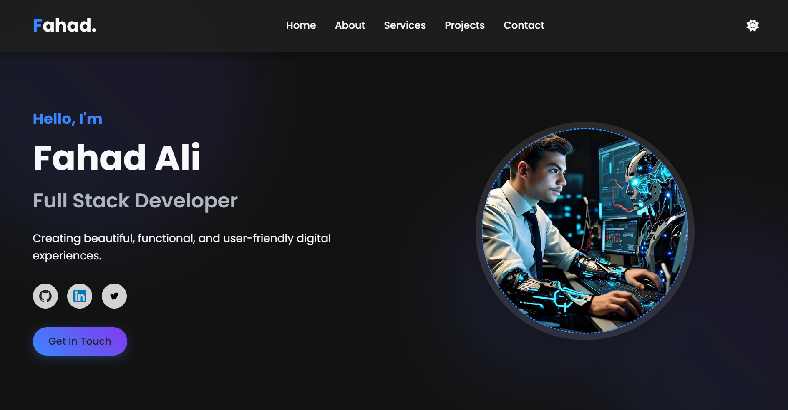
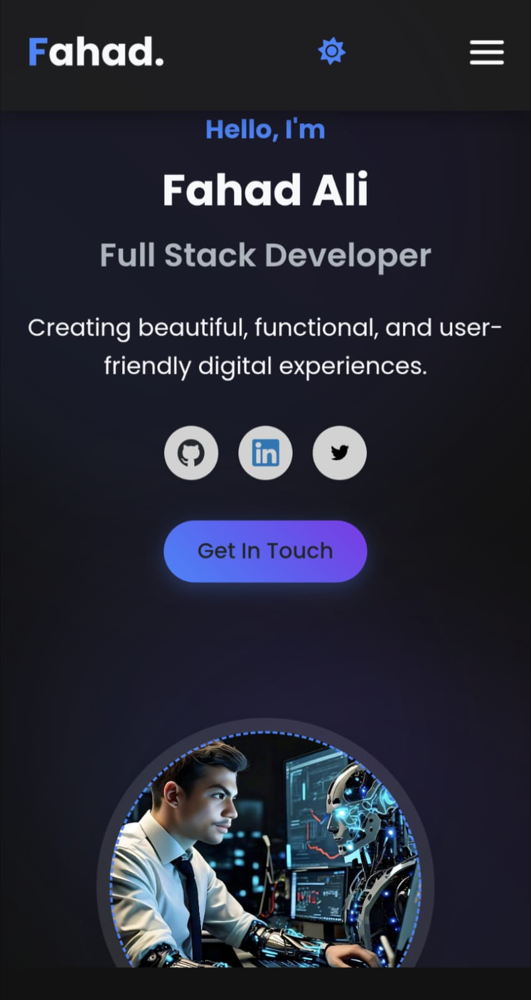

# 🚀 Fahad Ali – Developer Portfolio

Welcome to my personal developer portfolio! This website showcases my journey, skills, and projects as a Full Stack Developer, AI enthusiast, and Computer Science student.

---

## 🌐 Live Website

🔗 [Visit Portfolio](https://fahad-ali-github.github.io/FAHAD-ALI-Portfolio/)  
🧑‍💻 [My LinkedIn](https://www.linkedin.com/in/fahadali1078)

---

## 📌 Features

- 💼 **About Me** – Learn more about my background and career.
- 🛠️ **Projects** – Highlights of full stack, AI/ML, and other key projects.
- 📫 **Contact Section** – Get in touch with me easily.
- 📱 **Responsive Design** – Works perfectly on desktop and mobile.
- 🌙 **Dark Mode** – Smooth light/dark theme toggle.

---


## 📸 Screenshots

| Desktop View | Mobile View |
|--------------|-------------|
|  |  |

> Add screenshots in the `screenshots/` folder of your repo.

---

## 🚀 Getting Started

```bash
# Clone the repository
git clone https://github.com/FAHAD-ALI-github/FAHAD-ALI-Portfolio.git

# Navigate into the project directory
cd FAHAD-ALI-Portfolio

# Open index.html in your browser 

```


---

## 📬 Contact Me

📧 Email: fahad1078397@gmail.com  
🔗 LinkedIn: [fahadali1078](https://www.linkedin.com/in/fahadali1078)  
💻 GitHub: [@fahadali1078](https://github.com/FAHAD-ALI-github)
